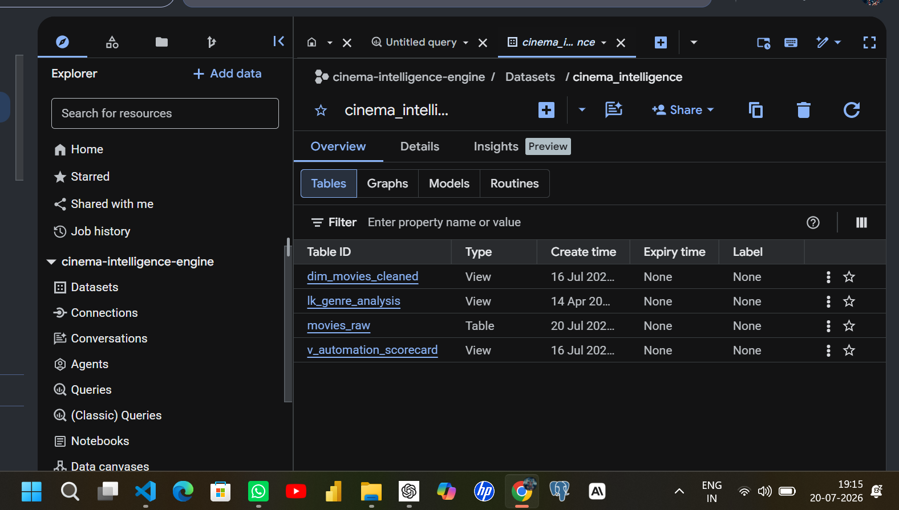
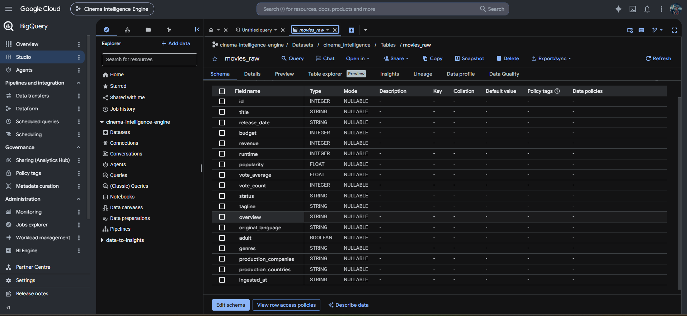
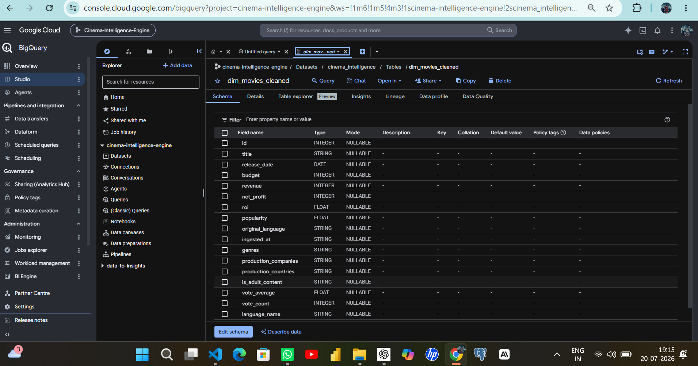
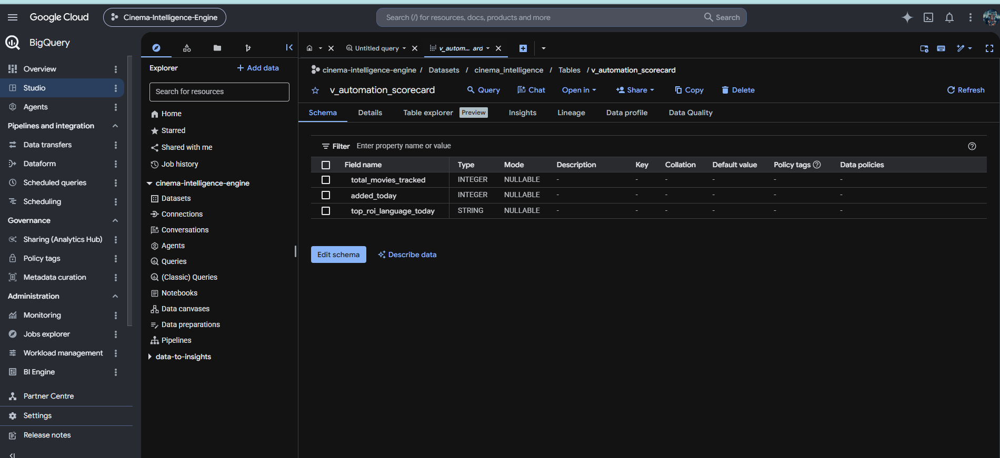
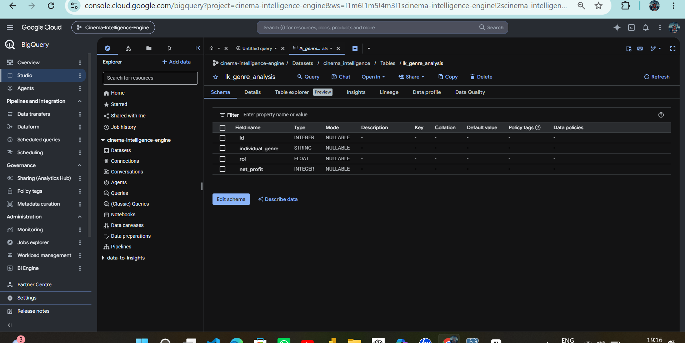
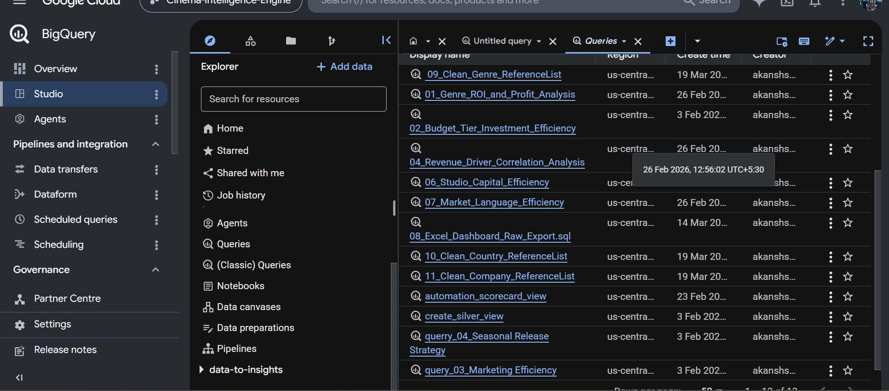

## 📌 Executive Summary
The **BigQuery Analytics Pipeline** serves as the central data warehousing and business intelligence transformation layer for the **TMDB Cinema Intelligence Engine**. Raw JSON/API payloads ingested via Python scripts are stored in BigQuery raw staging tables (Bronze layer) and subsequently transformed using modular SQL scripts and view definitions into curated analytical models (Silver layer).

This document details the architectural layout, table schemas, view definitions, data quality strategies, and analytical query suite used to derive studio ROI, budget efficiency, and release window insights.

---

## 🏗️ Data Architecture & Medallion Design

The BigQuery warehouse follows a two-tier Medallion Architecture:

```
┌───────────────────────────────────────────────────────────┐
│                      BRONZE LAYER                         │
│                    `movies_raw` (Table)                   │
│   • Direct API extraction payloads & staging metadata    │
└─────────────────────────────┬─────────────────────────────┘
                              │
                    SQL Transformation View
                              │
                              ▼
┌───────────────────────────────────────────────────────────┐
│                      SILVER LAYER                         │
│             `dim_movies_cleaned` (View)                   │
│   • Deduplicated, schema-enforced, and enriched records   │
└──────────────┬─────────────────────────────┬──────────────┘
               │                             │
               ▼                             ▼
  Analytical Query Suite              Looker Studio /
  (Queries 01 - 11)                   Google Sheets Sync
```

### Warehouse Tables & Views Summary


* **`movies_raw`**: Physical table storing ingested TMDB payloads with ingestion timestamps.
* **`dim_movies_cleaned`**: Primary cleaned Silver view with deduplication, string parsing, and metric engineering.
* **`v_automation_scorecard`**: Real-time pipeline monitoring view tracking daily ingestion volumes and top regional performance.
* **`lk_genre_analysis`**: Analytical view exploding array genres for granular ROI slicing.

---

## 📐 Table Schemas & Definitions

### 1. Raw Staging Table (`movies_raw`)


| Field Name | Type | Mode | Description |
| :--- | :--- | :--- | :--- |
| `id` | INTEGER | NULLABLE | Unique TMDB movie identifier |
| `title` | STRING | NULLABLE | Movie title |
| `release_date` | STRING | NULLABLE | Raw release date string |
| `budget` | INTEGER | NULLABLE | Production budget ($ USD) |
| `revenue` | INTEGER | NULLABLE | Box office revenue ($ USD) |
| `runtime` | INTEGER | NULLABLE | Movie runtime in minutes |
| `popularity` | FLOAT | NULLABLE | TMDB popularity index |
| `vote_average` | FLOAT | NULLABLE | Average user rating (0-10) |
| `vote_count` | INTEGER | NULLABLE | Total user ratings |
| `status` | STRING | NULLABLE | Release status |
| `tagline` | STRING | NULLABLE | Promotional tagline |
| `overview` | STRING | NULLABLE | Plot summary |
| `original_language` | STRING | NULLABLE | ISO 639-1 language code |
| `adult` | BOOLEAN | NULLABLE | Adult content flag |
| `genres` | STRING | NULLABLE | Raw comma-separated genre string |
| `production_companies` | STRING | NULLABLE | Raw production company string |
| `production_countries` | STRING | NULLABLE | Raw production country string |
| `ingested_at` | STRING | NULLABLE | Ingestion timestamp |

---

### 2. Cleaned Dimension View (`dim_movies_cleaned`)


```sql
CREATE OR REPLACE VIEW `cinema-intelligence-engine.cinema_intelligence.dim_movies_cleaned` AS
SELECT 
    *,
    CASE 
        WHEN original_language = 'hi' THEN 'Hindi'
        WHEN original_language = 'ml' THEN 'Malayalam'
        WHEN original_language = 'ta' THEN 'Tamil'
        WHEN original_language = 'te' THEN 'Telugu'
        WHEN original_language = 'kn' THEN 'Kannada'
        WHEN original_language = 'en' THEN 'English'
        ELSE 'Other International' 
    END AS language_name
FROM (
    SELECT 
        id, 
        title, 
        SAFE_CAST(release_date AS DATE) as release_date,
        COALESCE(budget, 0) as budget, 
        COALESCE(revenue, 0) as revenue, 
        (COALESCE(revenue, 0) - COALESCE(budget, 0)) as net_profit,
        
        -- True Financial ROI Definition: (Revenue - Budget) / Budget
        CASE 
            WHEN COALESCE(budget, 0) > 0 THEN SAFE_DIVIDE((COALESCE(revenue, 0) - COALESCE(budget, 0)), COALESCE(budget, 0))
            ELSE NULL 
        END AS roi,
        
        popularity, 
        original_language, 
        ingested_at, 
        IFNULL(CAST(genres AS STRING), 'Unknown') as genres,
        IFNULL(CAST(production_companies AS STRING), 'Unknown') as production_companies,
        IFNULL(CAST(production_countries AS STRING), 'Unknown') as production_countries, 
        IFNULL(CAST(adult AS STRING), 'false') as is_adult_content, 
        vote_average,
        vote_count
    FROM `cinema-intelligence-engine.cinema_intelligence.movies_raw`
    WHERE title IS NOT NULL 
      AND release_date IS NOT NULL
      AND release_date != '' 
    
    -- Pipeline Deduplication via Window Function
    QUALIFY ROW_NUMBER() OVER (PARTITION BY id ORDER BY (COALESCE(budget, 0) + COALESCE(revenue, 0)) DESC, ingested_at DESC) = 1
);
```

---

### 3. Pipeline Scorecard View (`v_automation_scorecard`)


```sql
CREATE OR REPLACE VIEW `cinema-intelligence-engine.cinema_intelligence.v_automation_scorecard` AS
SELECT 
    -- 1. Total lifetime volume tracked across warehouse history
    (SELECT COUNT(DISTINCT id) FROM `cinema_intelligence.dim_movies_cleaned`) as total_movies_tracked,
    
    -- 2. Cleaned delta load count converting the string to a timestamp with Indian Standard Time (IST)
    (SELECT COUNT(*) 
     FROM `cinema_intelligence.movies_raw` 
     WHERE DATE(SAFE_CAST(ingested_at AS TIMESTAMP), 'Asia/Kolkata') = CURRENT_DATE('Asia/Kolkata')) as added_today,
     
    -- 3. The highest performing language cohort pulled from today's active ingest window
    COALESCE(
        (SELECT language_name 
         FROM `cinema_intelligence.dim_movies_cleaned` 
         WHERE DATE(SAFE_CAST(ingested_at AS TIMESTAMP), 'Asia/Kolkata') = CURRENT_DATE('Asia/Kolkata')
           AND roi IS NOT NULL
         ORDER BY roi DESC 
         LIMIT 1), 
        'No New Ingest Data'
    ) as top_roi_language_today;
```

---

### 4. Granular Genre Lookup View (`lk_genre_analysis`)


---

## 🔍 Saved SQL Analytical Query Suite


Below is the complete suite of SQL transformation and analytical scripts saved in the BigQuery workspace:

### Query 01: Genre ROI and Profit Analysis
**File**: `01_Genre_ROI_and_Profit_Analysis.sql`
```sql
SELECT
  genres,
  COUNT(*) AS total_movies,
  ROUND(AVG(budget),2) AS avg_budget,
  ROUND(AVG(revenue),2) AS avg_revenue,
  ROUND(AVG(net_profit),2) AS avg_profit,
  ROUND(AVG(roi),2) AS avg_roi
FROM `cinema-intelligence-engine.cinema_intelligence.dim_movies_cleaned`
WHERE budget > 0 
  AND revenue > 0
GROUP BY genres
HAVING total_movies > 20
ORDER BY avg_profit DESC;
```

---

### Query 02: Budget Tier Investment Efficiency
**File**: `02_Budget_Tier_Investment_Efficiency.sql`
```sql
SELECT 
    CASE 
        WHEN budget < 10000000 THEN 'Low Budget (<$10M)'
        WHEN budget BETWEEN 10000000 AND 50000000 THEN 'Mid Budget ($10M-$50M)'
        WHEN budget BETWEEN 50000000 AND 150000000 THEN 'High Budget ($50M-$150M)'
        ELSE 'Mega Blockbuster (>$150M)'
    END as budget_tier,
    COUNT(*) as movie_count,
    ROUND(AVG(roi), 2) as avg_roi,
    ROUND(AVG(popularity), 2) as avg_popularity_score
FROM `cinema_intelligence.dim_movies_cleaned`
GROUP BY 1
ORDER BY avg_roi DESC;
```

---

### Query 03: Marketing vs. Profit Anomaly Detection
**File**: `03_Marketing_vs_Profit_Anomaly.sql`
```sql
SELECT 
    title,
    popularity,
    net_profit,
    roi
FROM `cinema_intelligence.dim_movies_cleaned`
WHERE popularity > (SELECT AVG(popularity) FROM `cinema_intelligence.dim_movies_cleaned`)
ORDER BY net_profit ASC
LIMIT 10;
```

---

### Query 04: Revenue Driver Correlation Analysis
**File**: `04_Revenue_Driver_Correlation_Analysis.sql`
```sql
SELECT
  CORR(popularity, revenue) AS popularity_revenue_correlation,
  CORR(vote_average, revenue) AS rating_revenue_correlation
FROM `cinema-intelligence-engine.cinema_intelligence.dim_movies_cleaned`
WHERE revenue > 0;
```

---

### Query 05: Seasonal Release ROI Analysis
**File**: `05_Seasonal_Release_ROI_Analysis.sql`
```sql
SELECT 
    EXTRACT(MONTH FROM release_date) as release_month,
    COUNT(*) as release_count,
    ROUND(AVG(revenue), 2) as avg_revenue,
    ROUND(AVG(roi), 2) as avg_roi
FROM `cinema_intelligence.dim_movies_cleaned`
GROUP BY 1
ORDER BY avg_revenue DESC;
```

---

### Query 06: Studio Capital Efficiency
**File**: `06_Studio_Capital_Efficiency.sql`
```sql
SELECT
  production_companies,
  COUNT(*) AS total_movies,
  ROUND(AVG(net_profit),2) AS avg_profit,
  ROUND(AVG(roi),2) AS avg_roi
FROM `cinema-intelligence-engine.cinema_intelligence.dim_movies_cleaned`
WHERE budget > 0 
  AND revenue > 0
GROUP BY production_companies
HAVING total_movies > 10
ORDER BY avg_profit DESC;
```

---

### Query 07: Market Language Efficiency
**File**: `07_Market_Language_Efficiency.sql`
```sql
SELECT
  language_name,
  COUNT(*) AS total_movies,
  ROUND(AVG(net_profit),2) AS avg_profit,
  ROUND(AVG(roi),2) AS avg_roi
FROM `cinema-intelligence-engine.cinema_intelligence.dim_movies_cleaned`
WHERE budget > 0
GROUP BY language_name
HAVING total_movies > 10
ORDER BY avg_profit DESC;
```

---

### Query 08: Excel Dashboard Raw Export
**File**: `08_Excel_Dashboard_Raw_Export.sql`
```sql
SELECT
  id,
  title,
  CAST(release_date AS DATE) AS release_date,
  EXTRACT(YEAR FROM release_date) AS release_year,
  EXTRACT(MONTH FROM release_date) AS release_month,
  budget,
  revenue,
  net_profit,
  roi,
  popularity,
  original_language,
  language_name,
  genres,
  production_companies,
  production_countries,
  is_adult_content,
  vote_average,
  vote_count,
  CASE 
    WHEN budget < 10000000 THEN 'Low (<$10M)'
    WHEN budget BETWEEN 10000000 AND 50000000 THEN 'Mid ($10M-$50M)'
    WHEN budget BETWEEN 50000000 AND 150000000 THEN 'High ($50M-$150M)'
    ELSE 'Blockbuster (>$150M)'
  END AS budget_tier
FROM `cinema-intelligence-engine.cinema_intelligence.dim_movies_cleaned`
ORDER BY release_date DESC;
```

---

### Reference Extraction Queries (Queries 09 - 11)

```sql
-- Query 09: Clean Genre Reference List
SELECT DISTINCT
  TRIM(genre) AS genre_name
FROM `cinema-intelligence-engine.cinema_intelligence.dim_movies_cleaned`,
UNNEST(SPLIT(genres, ',')) AS genre
WHERE genres IS NOT NULL
ORDER BY genre_name ASC;

-- Query 10: Clean Country Reference List
SELECT DISTINCT
  TRIM(country) AS country_name
FROM `cinema-intelligence-engine.cinema_intelligence.dim_movies_cleaned`,
UNNEST(SPLIT(production_countries, ',')) AS country
WHERE production_countries IS NOT NULL
ORDER BY country_name ASC;

-- Query 11: Clean Company Reference List
SELECT DISTINCT
  TRIM(company) AS company_name,
  COUNT(*) AS movie_count
FROM `cinema-intelligence-engine.cinema_intelligence.dim_movies_cleaned`,
UNNEST(SPLIT(production_companies, ',')) AS company
WHERE production_companies IS NOT NULL
GROUP BY company_name
HAVING movie_count >= 5
ORDER BY movie_count DESC;