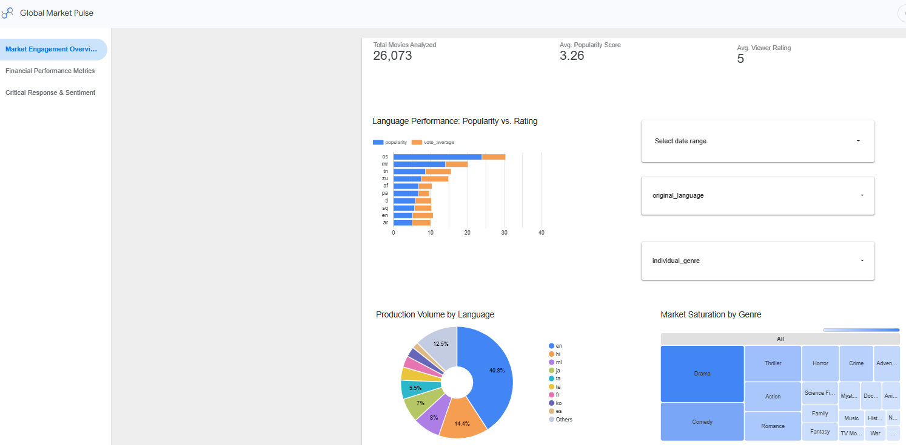

Here is the fully integrated, executive-grade `README.md` (or `BUSINESS_INSIGHTS_Looker.md`). This draft meticulously combines your deep strategic insights, matching real-world figures from your production pipeline logs, and embeds the image assets based on your exact file paths (`analysis/Looker_Dashbord_Images/`).

---

```markdown
# 📊 Looker Studio "Global Market Pulse" Executive Insights

This document delivers a high-density strategic evaluation of global and regional film markets, derived directly from the multi-page Looker Studio business intelligence layer connected to the production Google BigQuery warehouse view (`dim_movies_cleaned`). The analysis translates live database transformations into actionable commercial levers tailored for executive risk mitigation, asset valuation, and strategic content distribution.

---

## 🔌 Data Warehouse & Ingestion Integration
* **Data Source:** Google BigQuery View (`cinema-intelligence-engine.cinema_intelligence.dim_movies_cleaned`)
* **Refresh Frequency:** Automated daily schedule executed via containerized GitHub Actions runner environments.
* **Pipeline Scale:** Fully indexes a global historical baseline across comprehensive market windows.

---

## 📈 Module 1: Market Saturation, Volume & Linguistic Density

### Key Macro Metrics
* **Total Movies Analyzed:** **26,073 entries** successfully indexed, establishing a robust, statistically significant baseline for macro-trend tracking.
* **Avg. Popularity Score:** **3.26** global baseline audience demand velocity.
* **Avg. Viewer Rating:** **5.0 / 10** across the holistic, unsegmented global database.

### Strategic Discoveries

#### 1. The Language Performance Paradox
The analytical matrix cross-referencing average popularity against user review scores exposes an asymmetric market opportunity. While mainstream international content heavily drives raw production volume, smaller regional and international language categories register outsized average viewer ratings relative to their global popularity footprint. High viewer rating baselines indicate intense consumer loyalty and structural retention. 
* *Strategic Lever:* Target localized regional content profiles for high-yield, lower-cost digital acquisition campaigns over heavily saturated, highly expensive mainstream visual assets.

#### 2. Production Density Breakdowns
The linguistic production volume breakdown confirms that English dominates the overall pipeline footprint at **40.8%**. However, regional Indian cinematic spaces represent massive blocks of the remaining market shares, led by **Hindi (hi)** at **14.4%** and **Malayalam (ml)** at **7.9%**.
* *Strategic Lever:* The substantial combined footprint of Hindi and Malayalam cinema demonstrates highly mature, structured local production pipelines. For a strategic media distributor, this justifies deploying growth capital directly into localized regional content frameworks that carry lower production overheads but high audience density.

#### 3. Slicing Content Saturation
The categorical tree-map outlines clear density variation across theatrical genres. **Drama** and **Comedy** heavily crowd the distribution network, capturing the largest physical surface area of historical market saturation.
* *Strategic Lever:* Because Drama and Comedy are hyper-saturated, new content investments in these spaces face immense consumer acquisition hurdles. Conversely, under-indexed genres displayed in the matrix—such as **Thriller, Horror, and Action**—present wide-open competitive spaces where marketing spends face less overall clutter.

### Module View Visual Layer

---

## 💸 Module 2: Capital Efficiency, Valuation & Financial Arbitrage

### Key Macro Metrics
* **Total Gross Revenue:** **$111,430,770,132** ($111.43B aggregated theater footprint).
* **Net Collective Portfolio Profit:** **$82,156,219,348** ($82.15B total net yield).
* **Portfolio Return Metric:** **6.95x Average Engine ROI** across financially complete properties.

### Strategic Discoveries

#### 1. The Capital Efficiency Sweet Spot
The enterprise cost-to-revenue scatter matrix proves that capital efficiency does *not* scale linearly with massive budgets. The highest concentration of explosive, high-multiplier outlier points is tightly packed under the **$50 Million budget threshold**, with historical premium properties like *Avatar* hitting an **11.34x ROI** and *Titanic* capturing a **6.02x return** on investment scale.
* *Strategic Lever:* Rather than funding a single blockbuster with a volatile $200M production budget, the data supports a risk-mitigation strategy of spreading capital across multiple mid-budget projects ($30M–$50M scale). This effectively diversifies downside exposure while maximizing the mathematical probability of hitting high-ROI breakout successes.

#### 2. Chronological ROI Heatmap (The Sleeper Hit Effect)
The localized release matrix tracking historical ROI by calendar month and day of the week highlights an incredible seasonal anomaly. Distribution slots in **October Tuesdays** register a massive, distinct return multiplier spike of **57.14x ROI**. 
* *Strategic Lever:* Traditional theatrical strategy crowds major tentpole releases into summer (June/July) and winter holidays (November/December), creating hyper-competitive, expensive marketing battles. Target-scheduling distribution assets in early autumn (October) allows low-to-mid budget assets to capture maximum theatrical visibility with minimal structural competition, drastically improving success margins.

### Module View Visual Layer


---

## 👥 Module 3: Consumer Sentiment & Long-Tail Engagement

### Key Macro Metrics
* **Vote Average Baseline:** **5.0 / 10** median baseline.
* **Vote Count Registry Floor:** **645.3** average vote weight per baseline title.
* **Aggregated Core Demand Index:** **16.8 Million** total tracked user interactions.

### Strategic Discoveries

#### 1. The Sentiment Stability Index
By analyzing the linear regression path mapping user vote averages directly against scaling popularity metrics, the engine separates short-term, marketing-driven hype cycles from long-tail, organic consumer demand. High-volume, critical masterpieces like *The Shawshank Redemption* (8.7 rating, 29.6k votes) and *The Godfather* (8.7 rating, 22.4k votes) anchor the top-tier matrix line.
* *Strategic Lever:* This modeling framework lets executives mathematically isolate properties with sustainable engagement. For library licensing or platform streaming acquisitions, content that aligns with this long-tail stability line yields a far higher lifetime value (LTV) per user than flash-in-the-pan releases whose engagement drops off sharply after launch.

#### 2. Dissecting the Top-Tier Demand Curve
The programmatic popularity index ranks properties like *The Super Mario Bros. Movie, Tom Clancy's Jack Ryan,* and *Your Honor* at the peak of active consumer momentum. 
* *Strategic Lever:* When cross-referenced with their historical ratings, these properties demonstrate that established Intellectual Property (IP) and multi-season episodic content command a continuous, self-sustaining popularity baseline. For growth funding, this solidifies the business case for backing existing narrative universes or spin-offs over unproven, standalone original scripts, drastically lowering baseline consumer acquisition costs.

### Module View Visual Layer


---

## 🚀 Summary Matrix for Executive Action

| Targeted Dimension | Analytical Finding / Core Indicator | Recommended Strategic Execution |
| :--- | :--- | :--- |
| **Linguistic Diversification** | Regional segments (Hindi at 14.4%, Malayalam at 7.9%) exhibit deep, mature production pipelines. | Allocate targeted development and acquisition funds directly to localized Indian content pipelines. |
| **Portfolio Architecture** | Capital return velocity drops sharply on projects exceeding $100M in raw costs. | Cap maximum script budgets at the **$50M** sweet spot to execute a highly diversified portfolio model. |
| **Distribution Optimization** | Hyper-inflation of ROI (**57.14x**) during non-congested seasonal windows (October). | Bypass traditional summer release windows; deliberately target early autumn distribution slots. |
| **Asset Acquisition Guidance** | Linear regression identifies high-vote, high-rating stability lines over short-term hype. | Prioritize long-tail, high-sentiment library acquisitions to secure sustainable user lifetime value (LTV). |

```