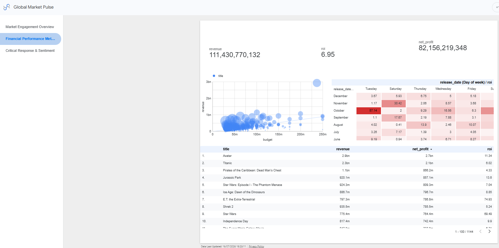
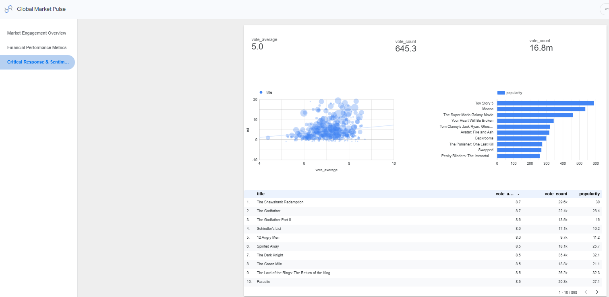

# 📊 Looker Studio Executive Dashboard Documentation

## 📌 Executive & Portfolio Overview
The **Looker Studio BI Dashboard** ("Global Market Pulse") serves as the executive visualization and analytics layer for the **TMDB Cinema Intelligence Engine**. Connected directly to Google BigQuery curated views (`dim_movies_cleaned` and `lk_genre_analysis`), this 3-page interactive suite translates raw box office records into actionable strategic and financial insights for film executives, investors, and distribution teams.

---

## 🏛️ Navigation & Dashboard Architecture

The dashboard is structured into **three dedicated thematic views** designed to move executives from macro market sizing to financial valuation, and finally to critical sentiment risk:

```
┌────────────────────────────────────────────────────────────────────────┐
│                        GLOBAL MARKET PULSE                             │
├────────────────────────────────┬───────────────────────────────────────┤
│ 1. Market Engagement Overview  │ Macro market share, languages & genres│
│ 2. Financial Performance       │ Yield analysis, ROI heatmaps & capital│
│ 3. Critical Response & Sentiment│ Critical acclaim vs commercial return│
└────────────────────────────────┴───────────────────────────────────────┘
```

---

## 📄 Page 1: Market Engagement Overview


### 🎯 Strategic Business Intent
Provides high-level situational awareness across global market volume, dominant distribution languages, and genre market saturation to identify underserved content niches.

### 💡 Executive KPI Summary
* **Total Movies Analyzed**: **26,073** titles tracked across global releases.
* **Avg. Popularity Score**: **3.26** across global content catalog.
* **Avg. Viewer Rating**: **5.0 / 10.0** normalized consumer score.

### 📈 Visual Breakdown & Key Findings
1. **Language Performance (Popularity vs. Rating)** *(Stacked Bar Chart)*:
   * **Insight**: Highlights market reach vs quality perception across languages. While English (`en`) dominates total volume, regional cohorts (e.g., Hindi `hi`, Malayalam `ml`, Telugu `te`) demonstrate high engagement relative to distribution scale.
2. **Production Volume by Language** *(Donut Chart)*:
   * **Insight**: English content represents **40.8%** of the global catalog, followed by Hindi (**14.4%**), Japanese (**8%**), and Malayalam (**7%**).
3. **Market Saturation by Genre** *(Treemap)*:
   * **Insight**: **Drama**, **Comedy**, **Thriller**, and **Action** command over 60% of total catalog volume, revealing high market saturation in traditional genres.
4. **Interactive Executive Filter Panel**:
   * Global controls for **Date Range**, **Original Language**, and **Individual Genre** to enable instant cohort slicing.

---

## 💰 Page 2: Financial Performance Metrics


### 🎯 Strategic Business Intent
Delivers capital efficiency auditing, box office yield modeling, and optimal calendar positioning (Release Window Strategy) for theatrical and streaming distributions.

### 💡 Executive Financial KPIs
* **Total Box Office Revenue**: **$111,430,770,132 ($111.43B)**
* **Total Net Profit Generated**: **$82,156,219,348 ($82.16B)**
* **Portfolio Average ROI**: **6.95x** return on production capital.

### 📈 Visual Breakdown & Financial Insights
1. **Capital Efficiency Scatter Plot (Budget vs. Revenue)** *(Bubble Chart)*:
   * **X-Axis**: Production Budget ($ USD) | **Y-Axis**: Box Office Revenue ($ USD) | **Bubble Size**: ROI.
   * **Financial Insight**: Identifies mid-budget "sweet spots" ($10M–$50M) yielding massive relative returns compared to overcrowded mega-blockbusters ($150M+) that face diminishing returns on capital.
2. **Release Calendar Yield Heatmap (Month vs. Day of Week ROI)** *(Pivot Table Matrix)*:
   * **Insight**: Visualizes capital efficiency across release windows. Pinpoints high-ROI anomalies (e.g., October/November theatrical windows driving peak ROI multipliers) to optimize release scheduling.
3. **Top Profit Leadership Ledger** *(Data Table)*:
   * Ranks flagship box office earners (*Avatar*, *Titanic*, *Pirates of the Caribbean*) alongside true ROI champions to evaluate capital return speed.

---

## 🎭 Page 3: Critical Response & Sentiment


### 🎯 Strategic Business Intent
Audits the correlation between critical acclaim (user vote scores) and commercial viability (ROI & popularity) to protect against over-investing in "critically acclaimed financial flops" or "cult popularity anomalies."

### 💡 Executive KPI Summary
* **Baseline Score Threshold**: **5.0 Vote Average** benchmark.
* **Volume Significance Floor**: **645.3 Avg. Vote Count**.
* **Global Consumer Reach**: **16.8M Aggregate Votes**.

### 📈 Visual Breakdown & Strategic Insights
1. **Acclaim vs. Capital Return Correlation** *(Scatter Chart with Trendline)*:
   * **X-Axis**: Vote Average (Rating) | **Y-Axis**: ROI | **Bubble Size**: Vote Count.
   * **Strategic Insight**: Demonstrates a positive correlation between audience sentiment and long-tail financial returns. High-rated titles (>8.0) consistently hedge financial downside risks.
2. **Popularity Multiplier Index** *(Horizontal Bar Chart)*:
   * Identifies trending cultural phenomena (*Toy Story 5*, *Moana*, *The Super Mario Galaxy Movie*) to measure current audience interest velocity.
3. **Historical Prestige Leaderboard** *(Data Table)*:
   * Audits top-tier critically acclaimed titles (*The Shawshank Redemption*, *The Godfather*, *Schindler's List*) against total vote volume to validate database normalization.

---

## 🛠️ Data Lineage & Connection Setup

```
[ BigQuery Views ] ──> [ GCP Native Connector ] ──> [ Looker Studio Dashboard ]
  • dim_movies_cleaned                                • Live Query Execution
  • lk_genre_analysis                                 • Custom Calculated Fields
```

### Calculated Fields Created in Looker Studio
* **ROI Multiplier**: `SUM(net_profit) / SUM(budget)`
* **Profit Margin %**: `SUM(net_profit) / SUM(revenue)`
* **Popularity Index**: `AVG(popularity)`